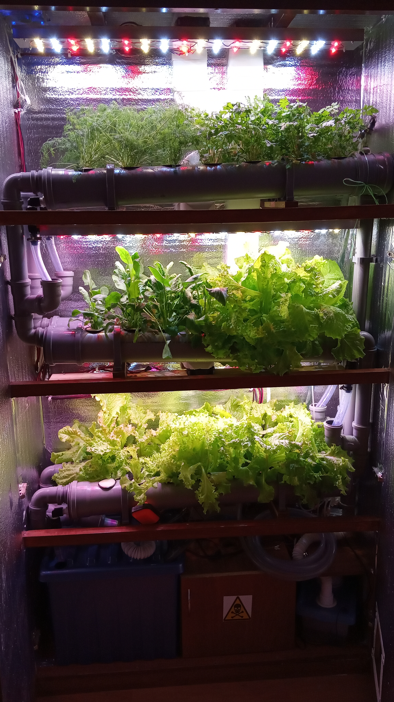
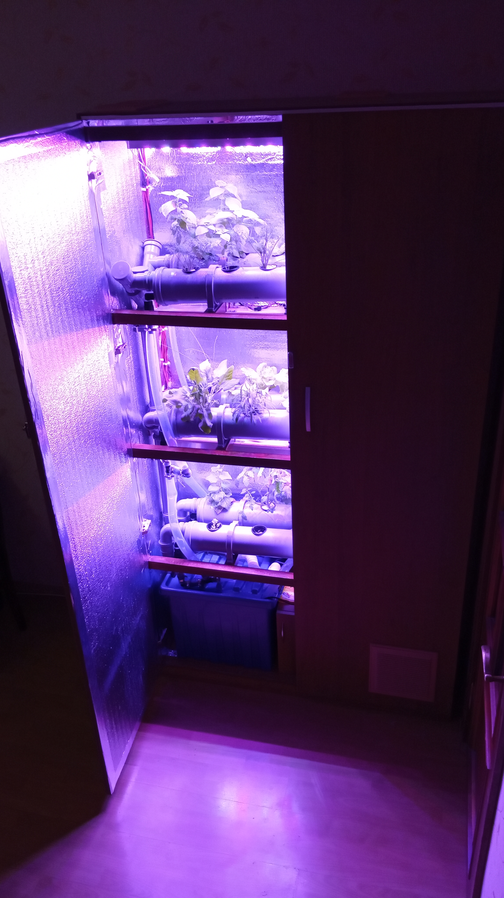
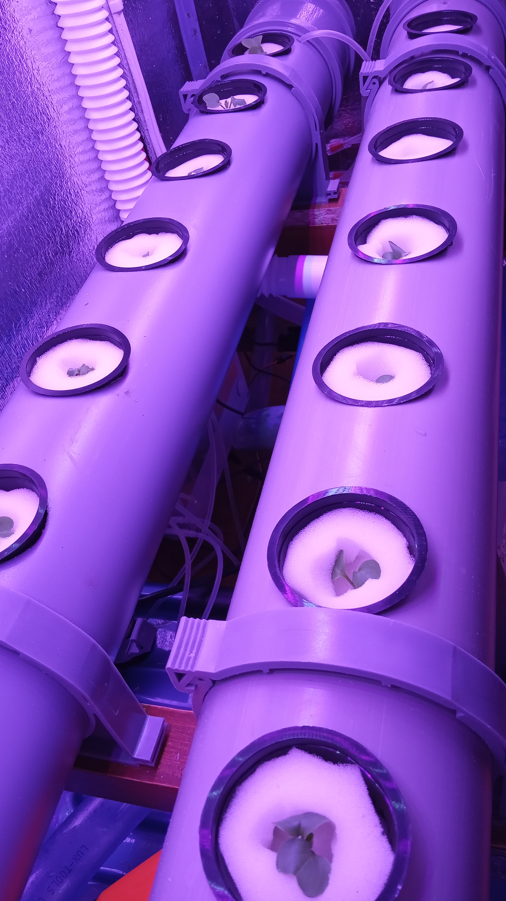
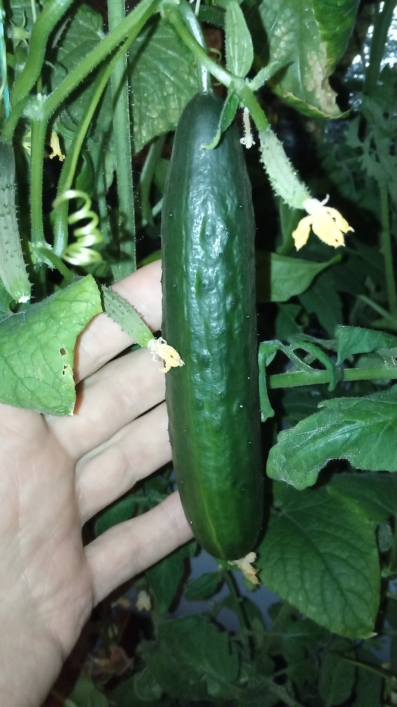
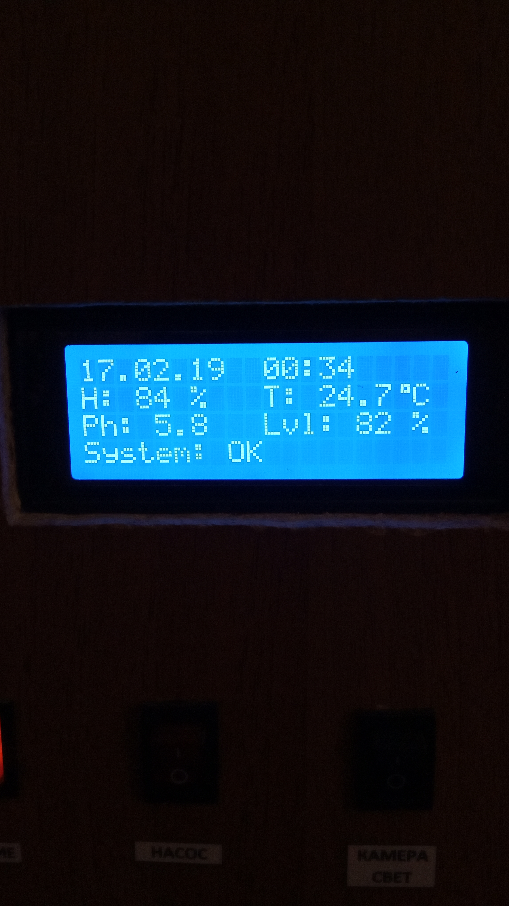
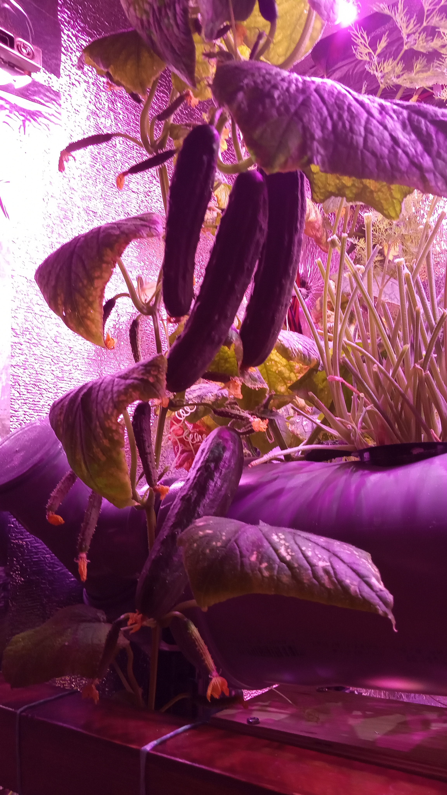
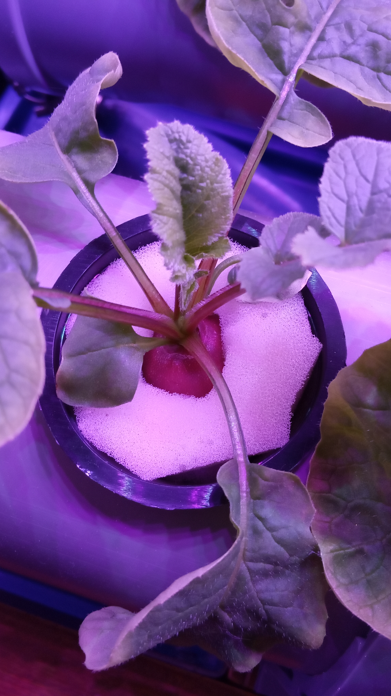
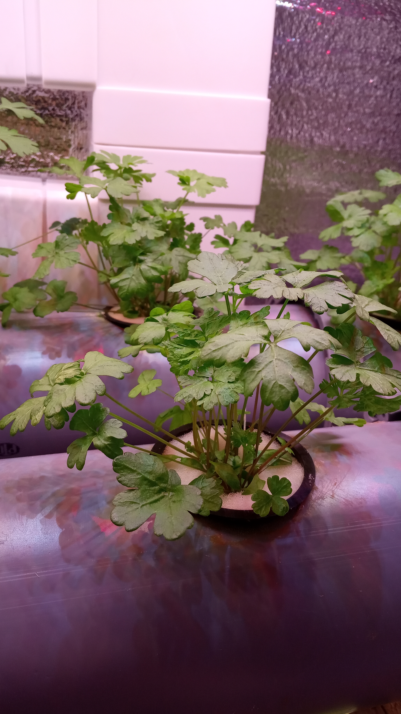

Automatic Hydroponic Farm

Arduino Project

Author: E-Protocol

You can see project results in instagram: @kuhnyafarm

NOTE: src file must be compiled in Arduino IDE before uploading on device, all libs from /libs folder should be imported in IDE. The System build on Arduino Mega 2560

Description:
This project can grow green food such as: lettuce, dill, parsley, basil, radish, leek, dwarf tomatoes and cucambers, strawberry. All you need is: 
- water 
- special Hydroponic fertilizers 
- Ph control solutions (Ph Up and Ph Down)
- seeds
- foam rubber

It takes 40-120 days to grow from seed to harvest (depending on crop type). Before use this system you need to create sprouts from seeds and put them into foam rubber (it takes aproximatley 7-14 days to create sprouts). You can also grow micro greens.

Update:
This system requires some modification for better results.
Problems:
- sometimes overheating (30 degrees or higher, depending on indoor temperature, recomended temperature is 24 degrees for crops). 
Solution: create better lamps cooling system
- pump should be lower than tank and it should be external
- humidifier cooler should be water resistant
- should be used cree leds or other high quality leds (i.e. light temperature should be correct to specification)
- Ph controll system should use independed little tank with own pump before mix with main tank. Tubes for Ph controll should be chemical resistant (i.e. sulphuric acid and alkali)
- different crops better grow at different light spectrum. 
Solution: build lamps with different spectrum modes (i.e. more blue spectrum or red spectrum depending on crop type and stage). Also it is better to imitate sunrise and sunset (for this lamps should work in different power mode at least for 1 hour at the beginning and end of daylight cycle).
